## Simple Docker
(Введение в докер. Разработка простого докер-образа для собственного сервера)

## Contents:

## [Part1. Готовый докер](#part-1-готовый-докер)
## [Part2. Операции с контейнером ](#part-2-операции-с-контейнером)
## [Part3. Мини веб-сервер](#part-3-мини-веб-сервер)
## [Part4. Свой докер](#part-4-свой-докер)
## [Part5. Dockle](#part-5-dockle)
## [Part6. Базовый Docker Compose](#part-6-базовый-docker-compose)

## Part 1. Готовый докер
### Возьми официальный докер-образ с **nginx** и выкачай его при помощи `docker pull`.
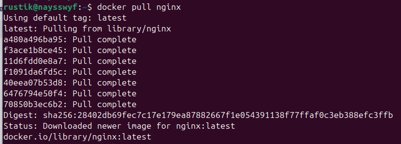

### Проверь наличие докер-образа через `docker images`.
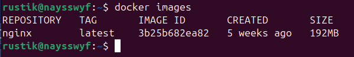

### Запусти докер-образ через `docker run -d [image_id|repository]`.
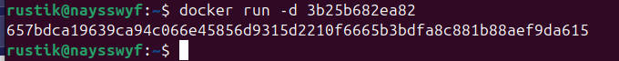

### Проверь, что образ запустился через `docker ps`.
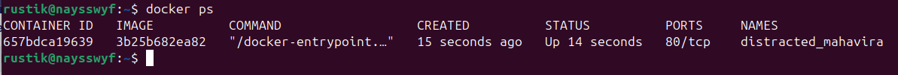

### Посмотри информацию о контейнере через `docker inspect [container_id|container_name]`.
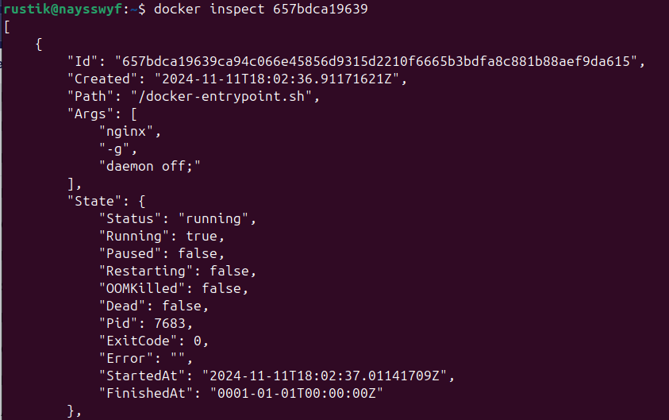

### По выводу команды определи и помести в отчёт размер контейнера, список замапленных портов и ip контейнера.
#### размер контейнера:
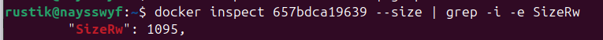

#### список замапленных портов
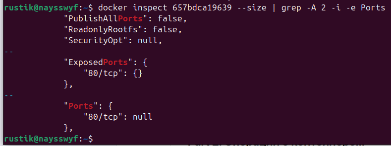

#### ip контейнера:
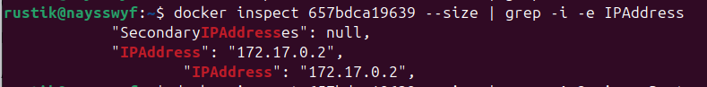

### Останови докер образ через `docker stop [container_id|container_name]`.
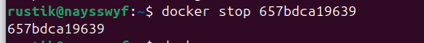

### Проверь, что образ остановился через `docker ps`.
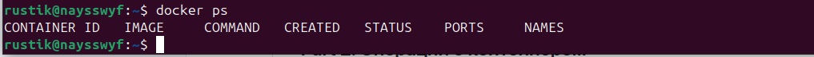

### Запусти докер с портами 80 и 443 в контейнере, замапленными на такие же порты на локальной машине, через команду *run*.
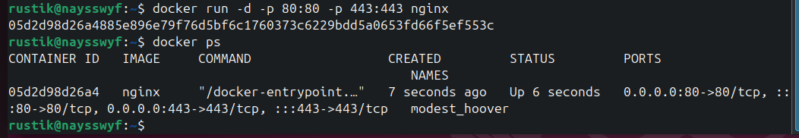

### Проверь, что в браузере по адресу *localhost:80* доступна стартовая страница **nginx**.
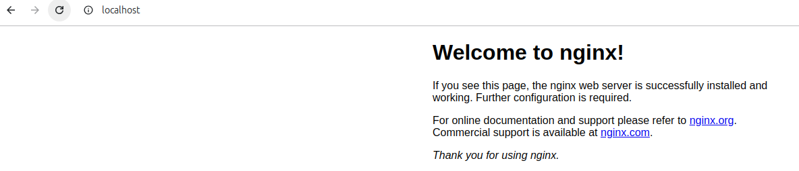

### Перезапусти докер контейнер через `docker restart [container_id|container_name]`.
### Проверь любым способом, что контейнер запустился.
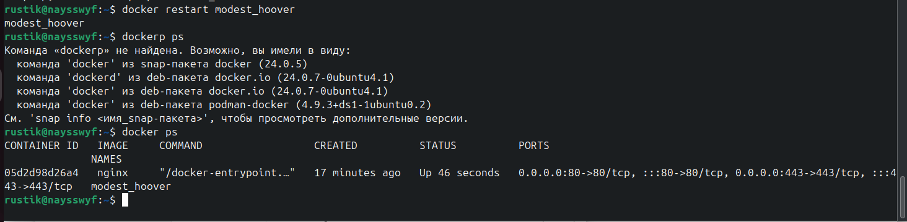

## Part 2. Операции с контейнером

Докер-образ и контейнер готовы. Теперь можно покопаться в конфигурации **nginx** и отобразить статус страницы.

**== Задание ==**

### Прочитай конфигурационный файл *nginx.conf* внутри докер контейнера через команду *exec*.
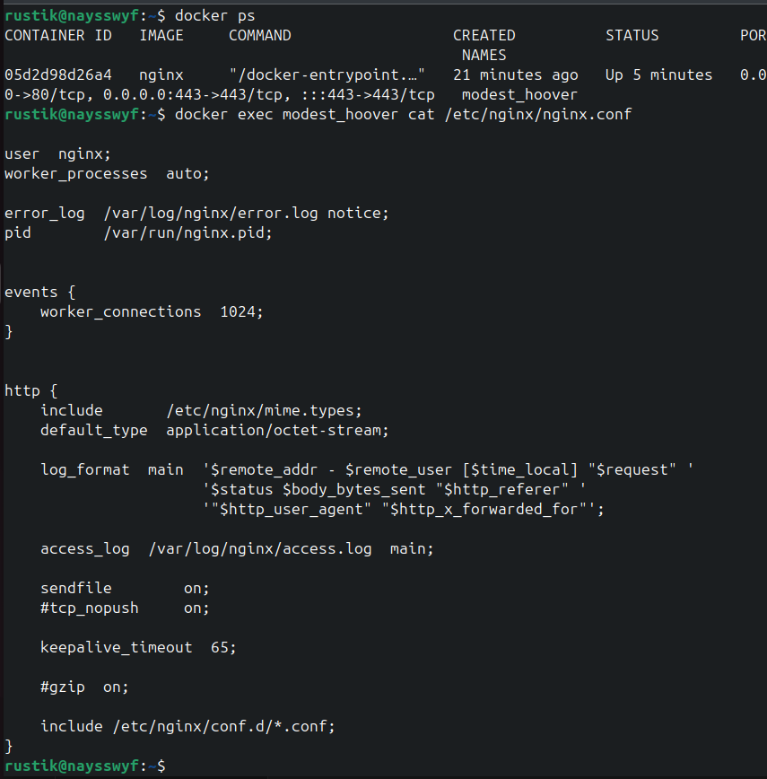

### Создай на локальной машине файл *nginx.conf*.
### Настрой в нем по пути */status* отдачу страницы статуса сервера **nginx**.
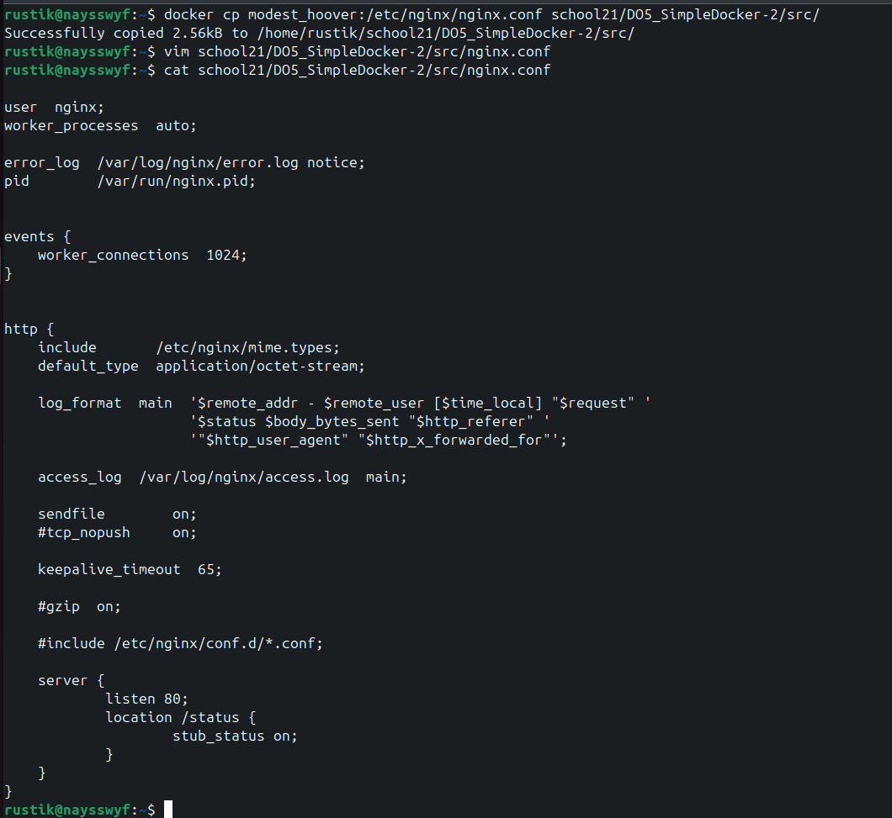

### Скопируй созданный файл *nginx.conf* внутрь докер-образа через команду `docker cp`.
### Перезапусти **nginx** внутри докер-образа через команду *exec*.
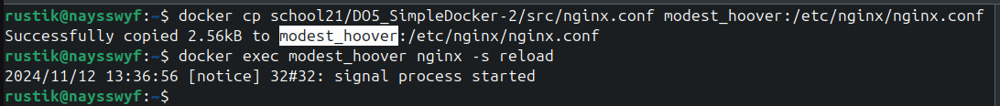

### Проверь, что по адресу *localhost:80/status* отдается страничка со статусом сервера **nginx**.
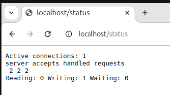

### Экспортируй контейнер в файл *container.tar* через команду *export*.
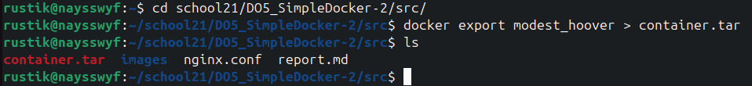

### Останови контейнер.
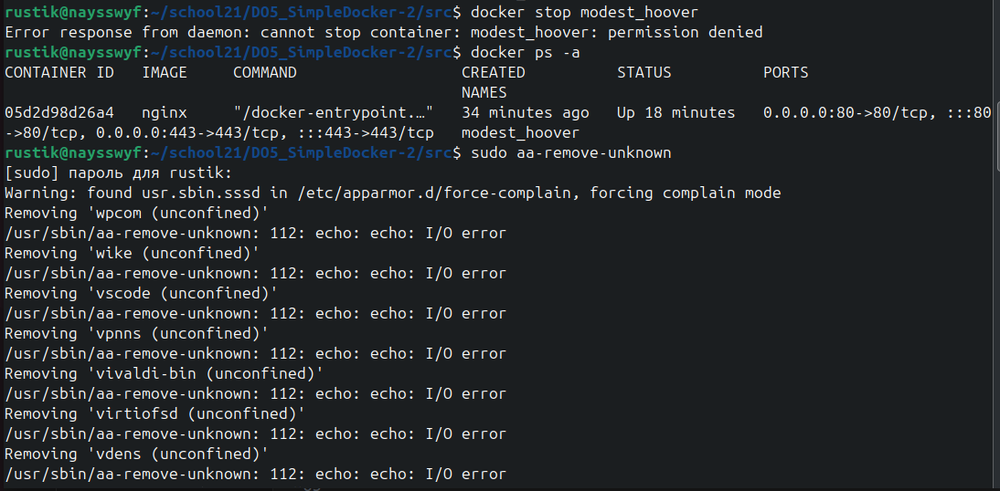
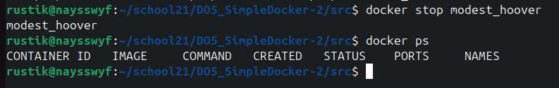

### Удали образ через `docker rmi [image_id|repository]`, не удаляя перед этим контейнеры.
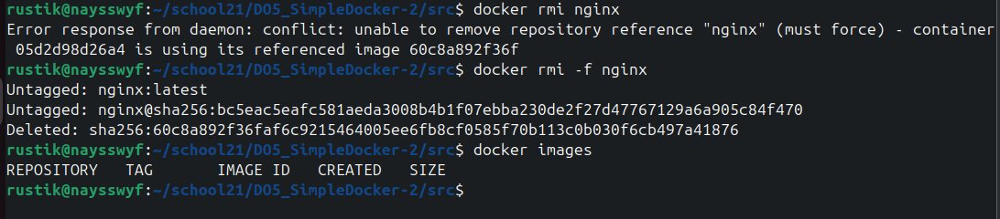

### Удали остановленный контейнер.
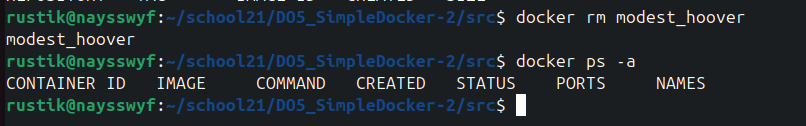

### Импортируй контейнер обратно через команду *import*.
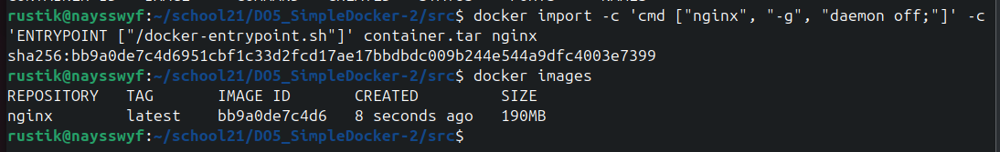

### Запусти импортированный контейнер.
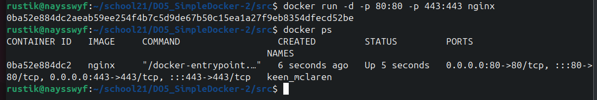
### Проверь, что по адресу *localhost:80/status* отдается страничка со статусом сервера **nginx**.
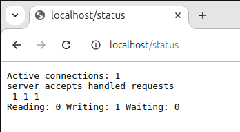

- В отчёт помести скрины:
  - вызова и вывода всех использованных в этой части задания команд;
  - содержимое созданного файла *nginx.conf*;
  - страницы со статусом сервера **nginx** по адресу *localhost:80/status*.

## Part 3. Мини веб-сервер

Теперь стоит немного оторваться от докера, чтобы подготовиться к последнему этапу. Время написать свой сервер.

**== Задание ==**

### Пишeм мини-сервер на **C** и **FastCgi**, который будет возвращать простейшую страничку с надписью `Hello World!`.
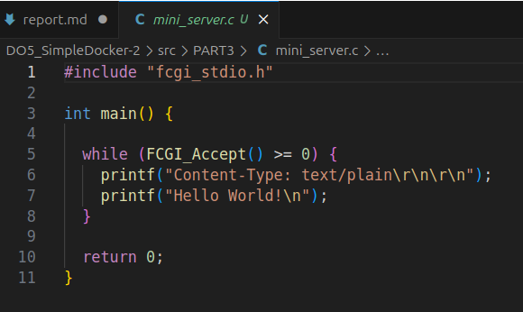

###  Проверяем наличие образа **nginx**, запускаем контейнер на порт 81
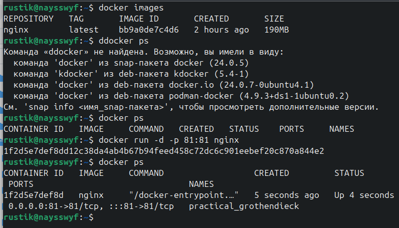

###  Создаём свой *nginx.conf*, который будет проксировать все запросы с 81 порта на *127.0.0.1:8080*.
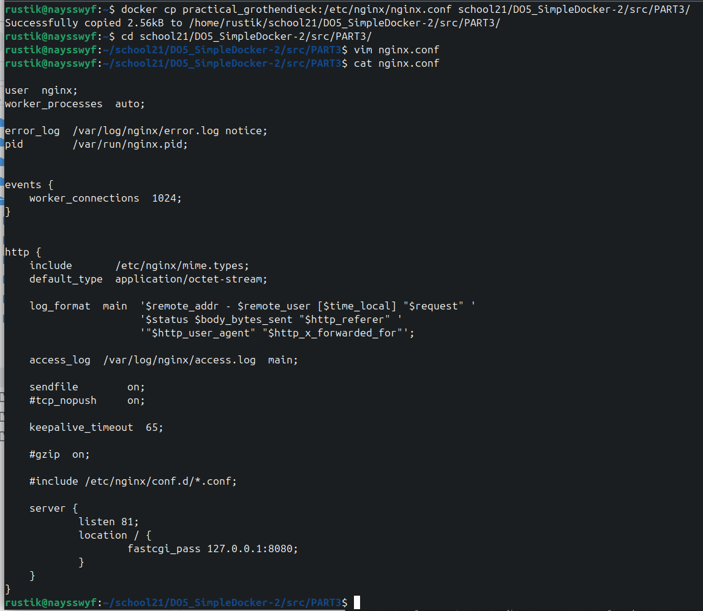

###  Копируем в контейнер файл приложения *mini_server.c* и *nginx.conf* 
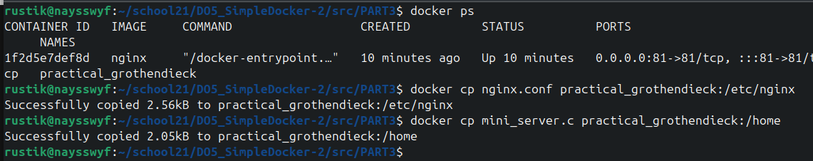

###  Внутри контейнера обновляем репозитории и устанавливаем gcc, spawn-fcgi и libfcgi-dev
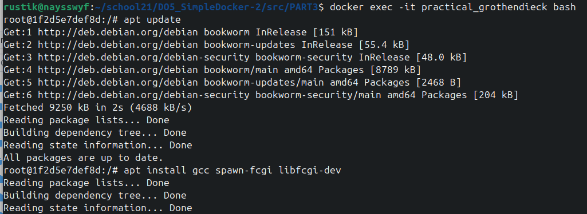

###  Компилируем
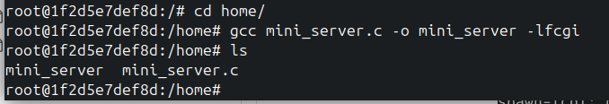

### Запускаем написанный мини-сервер через *spawn-fcgi* на порту 8080.
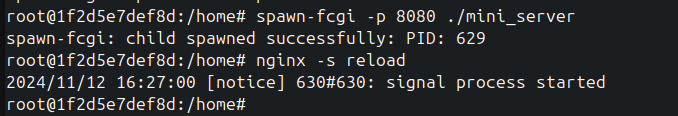

### Проверь, что в браузере по *localhost:81* отдается написанная тобой страничка.
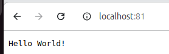

### Положи файл *nginx.conf* по пути *./nginx/nginx.conf* (это понадобится позже).
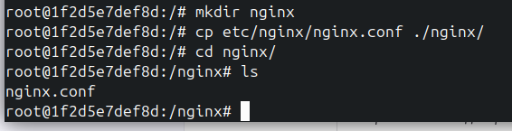

## Part 4. Свой докер

Теперь всё готово. Можно приступать к написанию докер-образа для созданного сервера.
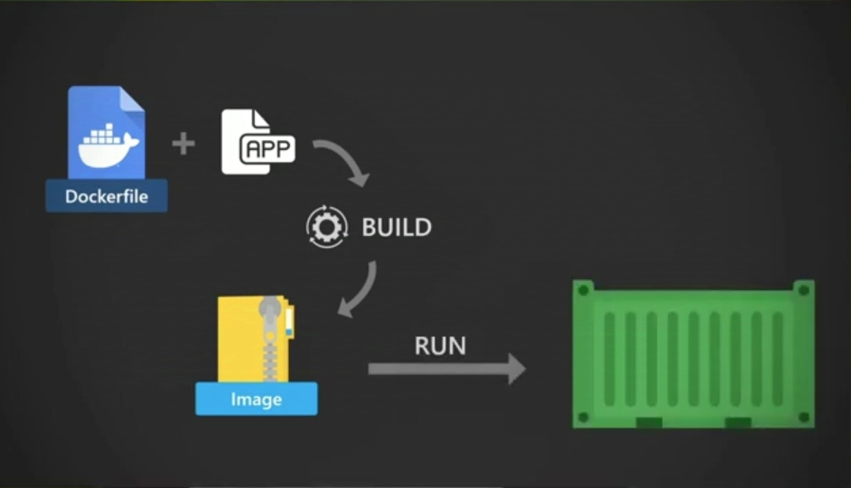

**== Задание ==**

### Напиши свой докер-образ, который:
#### 1) собирает исходники мини сервера на FastCgi из [Части 3](#part-3-мини-веб-сервер);
#### 2) запускает его на 8080 порту;
#### 3) копирует внутрь образа написанный *./nginx/nginx.conf*;
#### 4) запускает **nginx**.
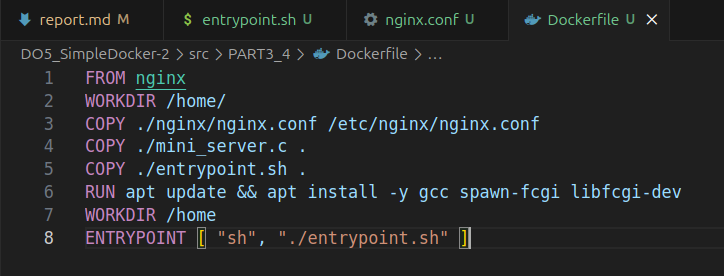
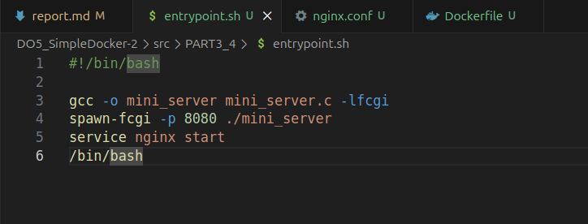
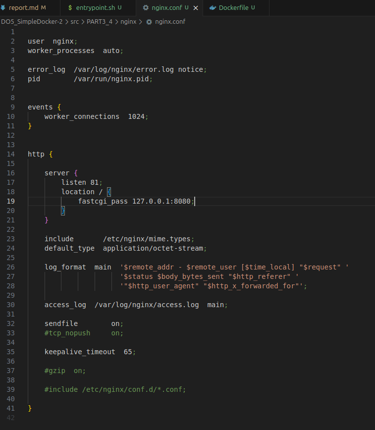

### Собери написанный докер-образ через `docker build` при этом указав имя и тег.
### Проверь через `docker images`, что все собралось корректно.
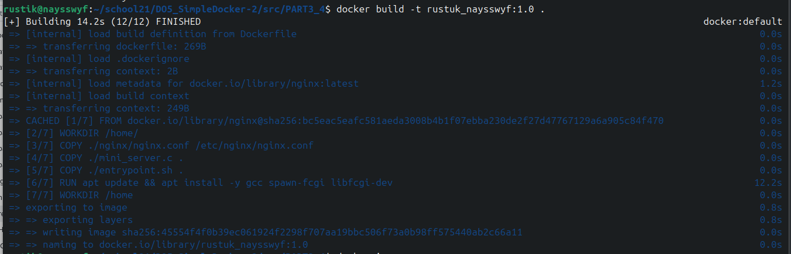
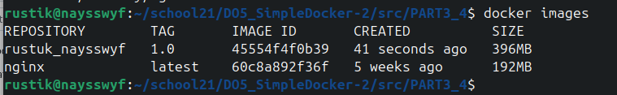

### Запусти собранный докер-образ с маппингом 81 порта на 80 на локальной машине и маппингом папки *./nginx* внутрь контейнера по адресу, где лежат конфигурационные файлы **nginx**'а (см. [Часть 2](#part-2-операции-с-контейнером)).
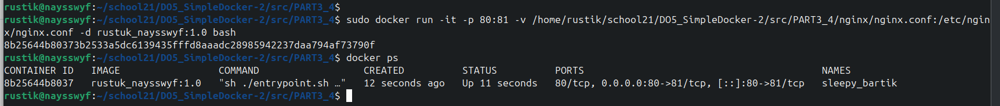

### Проверь, что по localhost:80 доступна страничка написанного мини сервера.
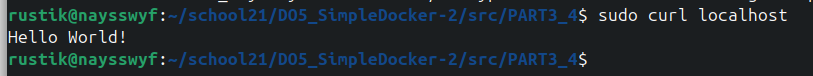
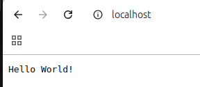

### Допиши в *./nginx/nginx.conf* проксирование странички */status*, по которой надо отдавать статус сервера **nginx**.
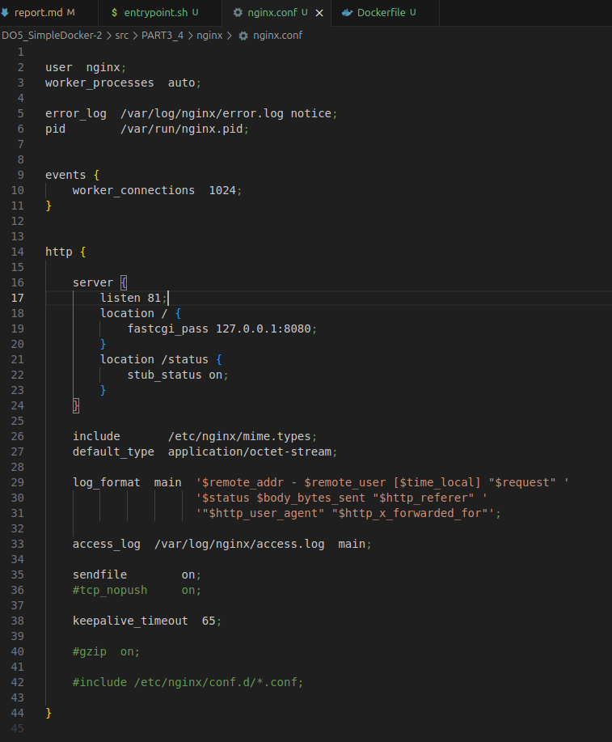

### Перезапусти докер-образ.
### Проверь, что теперь по *localhost:80/status* отдается страничка со статусом **nginx**
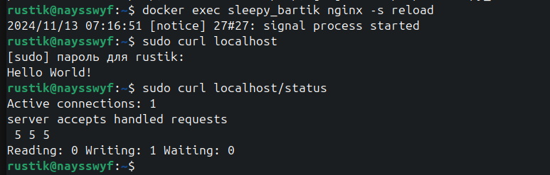
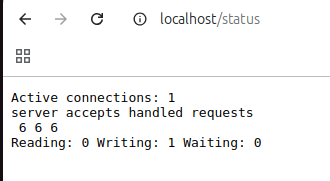

## Part 5. **Dockle**

После написания образа никогда не будет лишним проверить его на безопасность.

Dockle — инструмент для проверки безопасности образов контейнеров, который можно использовать для поиска уязвимостей. Кроме того, с его помощью можно выполнять проверку на соответствие Best Practice, чтобы убедиться, что образ действительно создаётся на основе сохраненной истории команд.

**== Задание ==**

### Скачивание и установка dockle
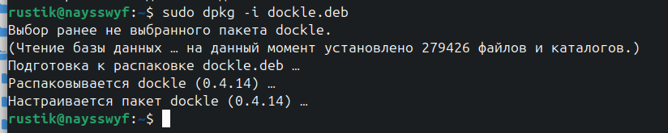

### Просканируй образ из предыдущего задания через `dockle [image_id|repository]`.
#### Ошибки
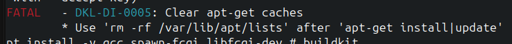
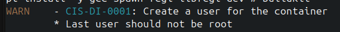

#### Исправил Dockerfile
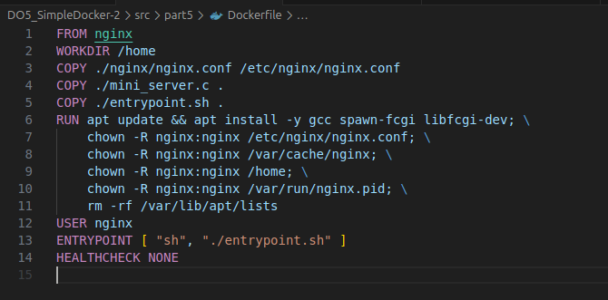

### Теперь при проверке через **dockle** нет ошибок и предупреждений.
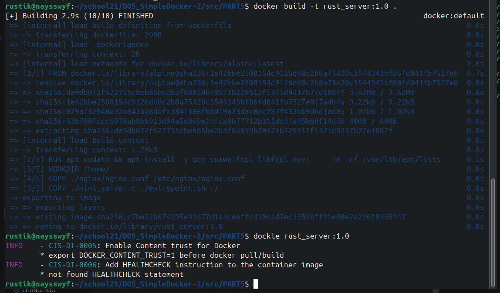

## Part 6. Базовый **Docker Compose**

### Docker Compose — это инструментальное средство, входящее в состав Docker. Оно предназначено для решения задач, связанных с развёртыванием проектов.Технология Docker Compose, если описывать её упрощённо, позволяет, с помощью одной команды, запускать множество сервисов.

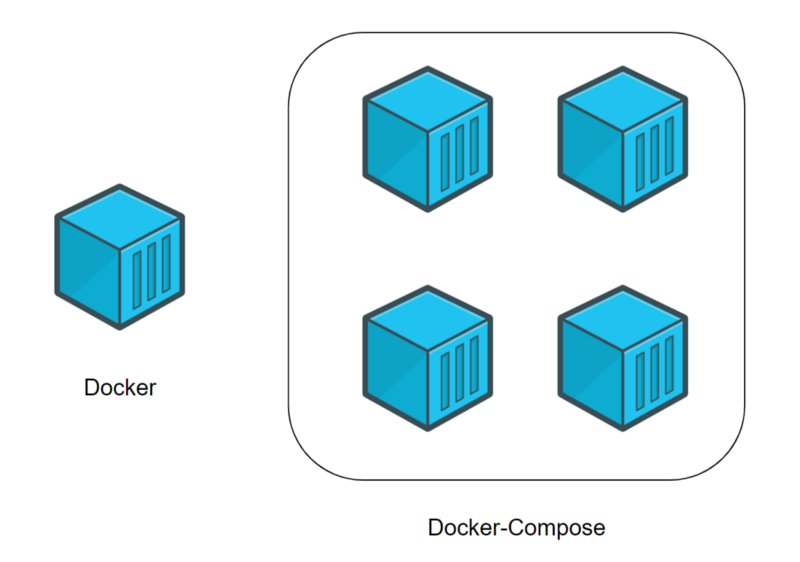

**== Задание ==**

#### Для начала узнаем версию docker-compose.
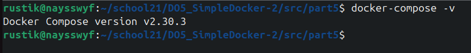

#### создадим в корне проекта файл *docker-compose.yml*, с помощью которого поднимем докер-контейнер из [Части 5] (он должен работать в локальной сети) и новый докер-контейнер с **nginx**, который будет проксировать все запросы с 8080 порта на 81 порт первого контейнера.
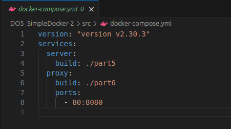

#### Настроим nginx.conf второго контейнера.
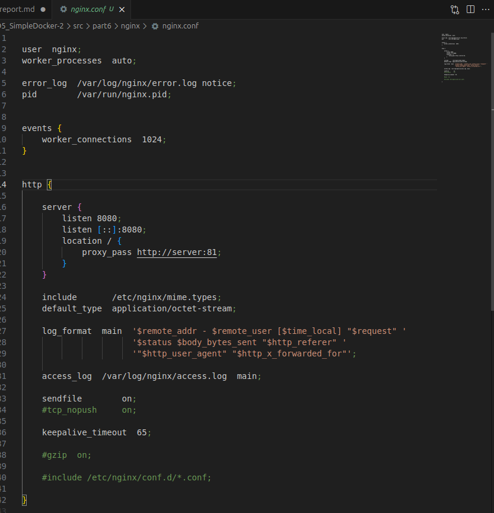

#### Настроим Dockerfile второго контейнера.
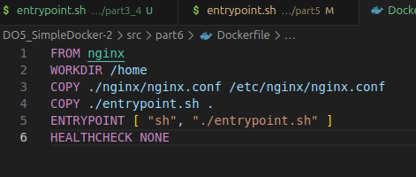
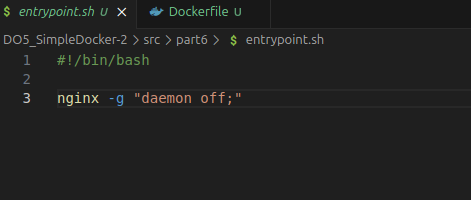

#### Остановим все запущенные контейнеры.
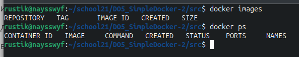

#### Соберём проект с помощью команд *docker-compose build*
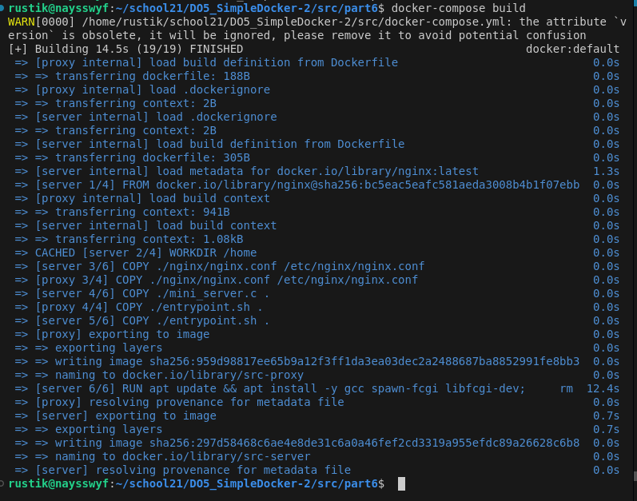

#### Запусти проект с помощью команды *docker-compose up*
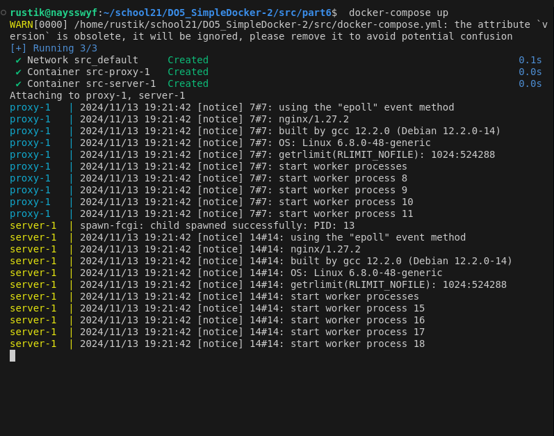

#### Проверим, что в браузере по *localhost:80* отдается написанная страничка, как и ранее.
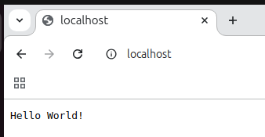

## THE END.